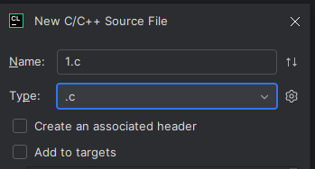
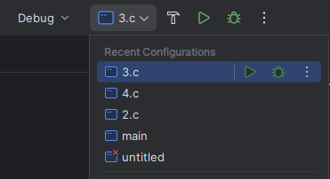

# CLION setup multiple files

1. Right-click source directory 
2. Select New->C/C++ Source File
3. Name your file, select .c, uncheck Add to targets

4. Go to Settings (CTRL + Alt + S) and go to Build, Execution, Deployment->CMake
5. Check Reload CMake project ... and click Apply/OK

6. Go to CMakeLists.txt file
7. Add new line add_executable(\<configuration name> \<.c file name>) (You need to do this part for each new file)

8. On top-right you should see configurations of your c files

In case of any issues you can follow this tutorial: [tutorial](https://www.youtube.com/watch?v=Ok4eHRPcb2g)